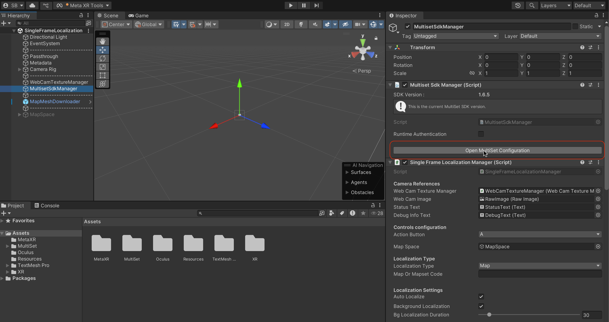
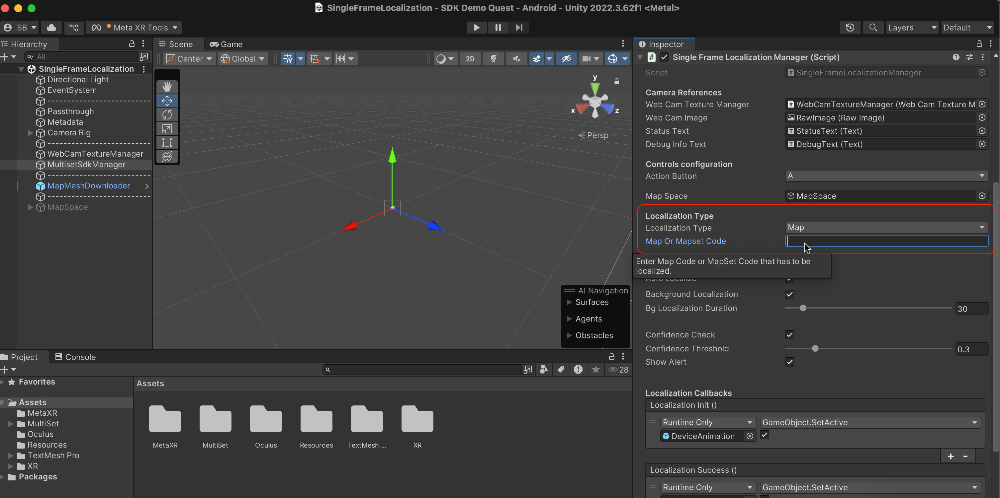
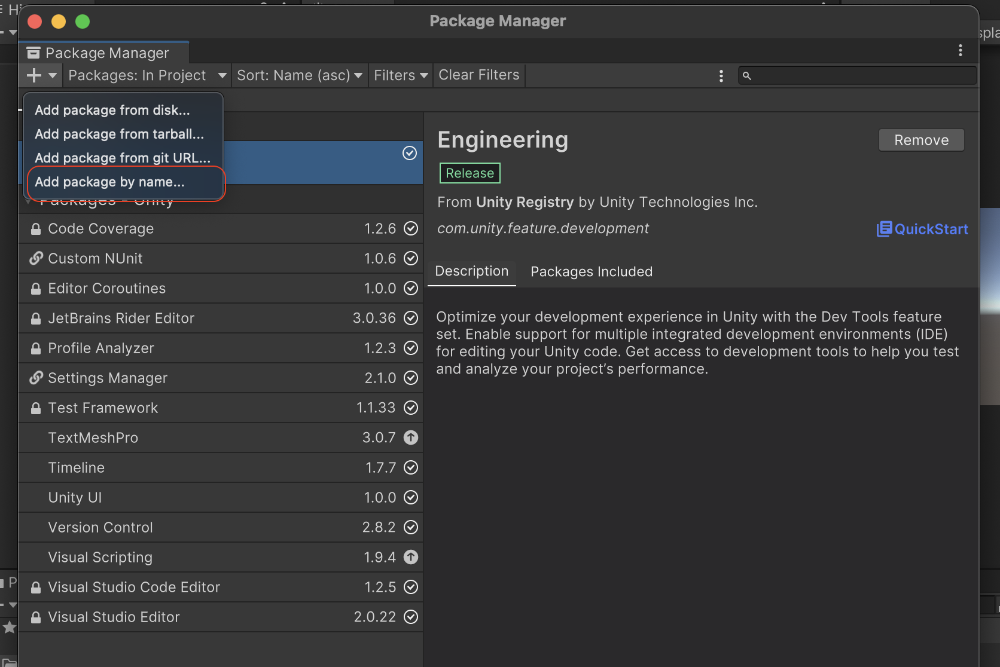
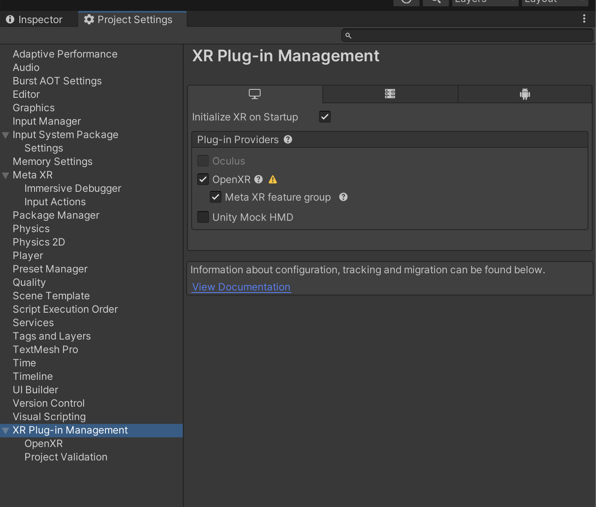
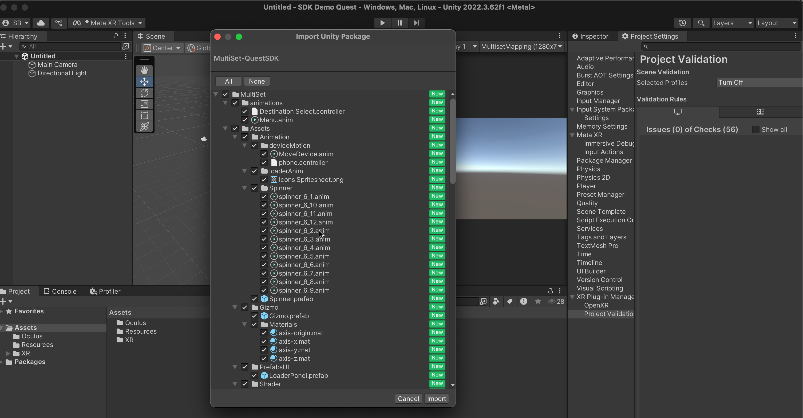
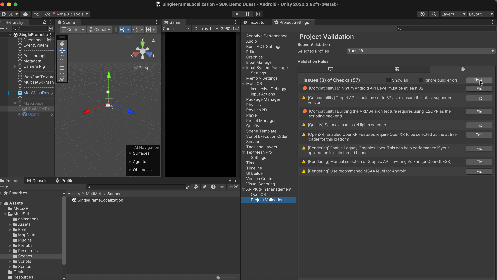

# Installation Guide

The MultiSet Quest SDK can be integrated into your Unity project using two different approaches. Choose the method that best fits your development workflow.

## Prerequisites

Before starting, ensure you have:
- **Unity 2022.3.50+** (recommended: 2022.3.58f1 or later)
- **Android Build Support** module installed
- **Meta Quest 3, 3S** device
- **Stable internet connection** for VPS functionality
- **MultiSet API credentials** (Client ID and Client Secret from [multiset.ai](https://multiset.ai))

## Option 1: Clone SDK Repository (Recommended)

This is the fastest way to get started with a complete, ready-to-use project.

### Step 1: Clone the Repository

Clone the MultiSet Quest SDK repository directly:

```bash
git clone https://github.com/MultiSet-AI/multiset-quest-sdk.git
```

### Step 2: Open in Unity

1. Launch **Unity Hub**
2. Click **"Open"** and select the cloned repository folder
3. Unity will automatically import all required dependencies

### Step 3: Project Structure

After opening, you'll see the following folder structure:

```
Assets/
├── MetaXR/                    # Meta XR SDK components
├── MultiSet/                  # MultiSet SDK core files
│   ├── Assets/               # SDK assets and resources
│   ├── Plugins/              # Platform-specific plugins
│   ├── Resources/            # Runtime resources
│   ├── Scripts/              # Core SDK scripts
│   └── Sprites/              # UI sprites and icons
├── Oculus/                   # Oculus integration
└── Plugins/                  # Additional plugins
```

### Step 4: Configure API Credentials

1. Navigate to `Assets/MultiSet/Resources/MultiSetConfig.asset`
2. Open the file and replace the placeholder values:

```csharp
Client Id = "YOUR_CLIENT_ID";
Client Secret = "YOUR_CLIENT_SECRET";
```


### Step 5: Configure Map Settings

1. Open the scene: `Assets/MultiSet/Scenes/SingleFrameLocalization.unity`
2. Select the **MultisetSdkManager** GameObject in the hierarchy
3. In the Inspector, locate the **SingleFrameLocalizationManager** component
4. Choose your localization method:
   - **Map**: For single, specific locations
   - **MapSet**: For multiple related locations or larger areas
5. Enter your **mapCode** or **mapSetCode** accordingly




### Step 6: Build and Test

1. Connect your **Meta Quest** device via USB
2. Go to **File > Build Settings**
3. Ensure **Android** platform is selected
4. Click **Build and Run**
5. Test **Localization** functionality on your device

---

## Option 2: Add SDK to Existing Project

Use this method to integrate the MultiSet SDK into an existing Unity project.

### Step 1: Install Required Dependencies

Open **Window > Package Manager** and install the following packages by name:

#### Core Meta XR Packages
- `com.meta.xr.sdk.core`
- `com.meta.xr.mrutilitykit`

#### Unity Cloud Packages
- `com.unity.cloud.gltfast`
- `com.unity.cloud.draco`



### Step 2: Configure XR Plugin Management

1. Go to **Edit > Project Settings**
2. Navigate to **XR Plug-in Management**
3. If not installed, click **"Install XR Plugin Management"**
4. Under **Plug-in Providers**, enable **OpenXR**



### Step 3: Import MultiSet SDK Package

1. Download the **MultiSet-Quest-SDK.unitypackage** from the [GitHub releases](https://github.com/MultiSet-AI/multiset-quest-sdk/releases)
2. In Unity, go to **Assets > Import Package > Custom Package**
3. Select the downloaded `.unitypackage` file
4. Click **Import** to add all SDK components to your project



### Step 4: Platform Configuration

1. Go to **File > Build Settings**
2. Select **Android** and click **Switch Platform**
3. Navigate to **Edit > Project Settings > XR Plug-in Management**
4. Click **"Project Validation"**
5. Click **"Fix All"** to resolve any configuration issues



### Step 5: Configure API Credentials

1. Navigate to `Assets/MultiSet/Resources/MultiSetConfig.asset`
2. Update your credentials:

```csharp
Client Id = "YOUR_CLIENT_ID";
Client Secret = "YOUR_CLIENT_SECRET";
```


### Step 6: Scene Setup

1. Create a new scene or use an existing one
2. Select the **MultisetSdkManager** GameObject
3. In the **SingleFrameLocalizationManager** component:
   - Choose between **"map"** or **"mapSet"**
   - Enter your **mapCode** or **mapSetCode**


### Step 7: Camera Permissions

The SDK automatically configures HEADSET CAMERA permissions, but verify in `Assets/Plugins/Android/AndroidManifest.xml`:

```xml
<uses-permission android:name="horizonos.permission.HEADSET_CAMERA" />
```

### Step 8: Build and Test

1. Connect your Meta Quest device
2. Go to **File > Build Settings**
3. Click **Build and Run**
4. Test localization on your device

---

## Verification Checklist

verify sdk setup:

- [ ] Unity version is 2022.3.50 or later
- [ ] Android platform is selected
- [ ] OpenXR is enabled in XR Plugin Management
- [ ] API credentials are configured in `MultiSetConfig.cs`
- [ ] Map code/set code is entered in MultisetSdkManager
- [ ] HEADSET CAMERA permissions are present in Android manifest
- [ ] Sample scene loads without errors

## Next Steps

Once setup is complete:

1. **Test the sample scene**: Run `SingleFrameLocalization.unity` to verify functionality
2. **Review the documentation**: Check [docs.multiset.ai](https://docs.multiset.ai) for advanced features
3. **Integrate into your app**: Use the SDK components in your own scenes

## Troubleshooting

### Common Installation Issues

**Package Manager errors**: Ensure Unity Hub and Unity Editor are up to date

**XR Plugin issues**: Restart Unity after enabling OpenXR

**Build failures**: Run Project Validation and fix all issues before building

**Credential errors**: Verify your Client ID and Secret are correct from your MultiSet dashboard

For additional support, contact [support@multiset.ai](mailto:support@multiset.ai)
